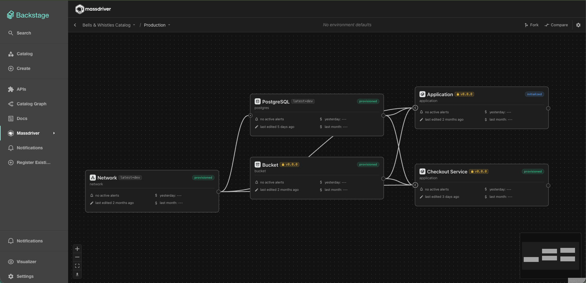
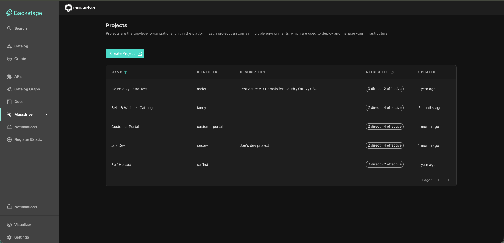
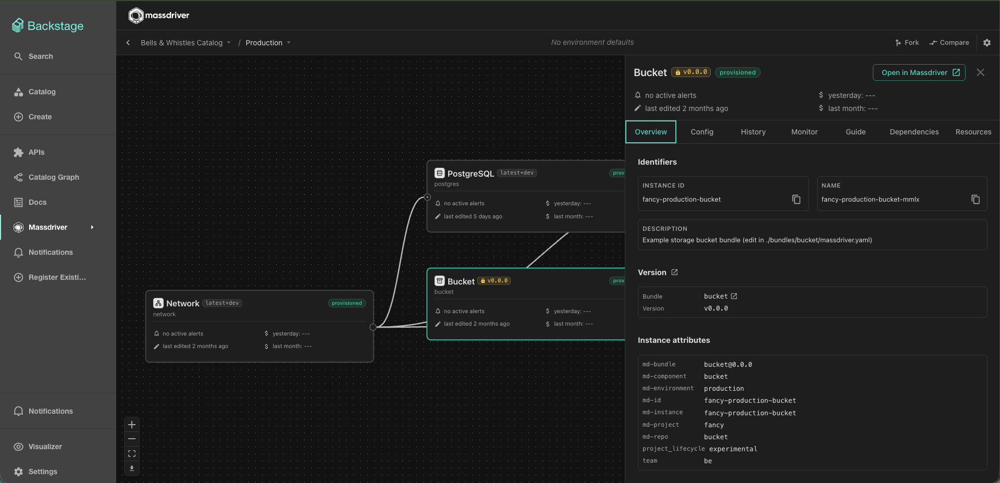
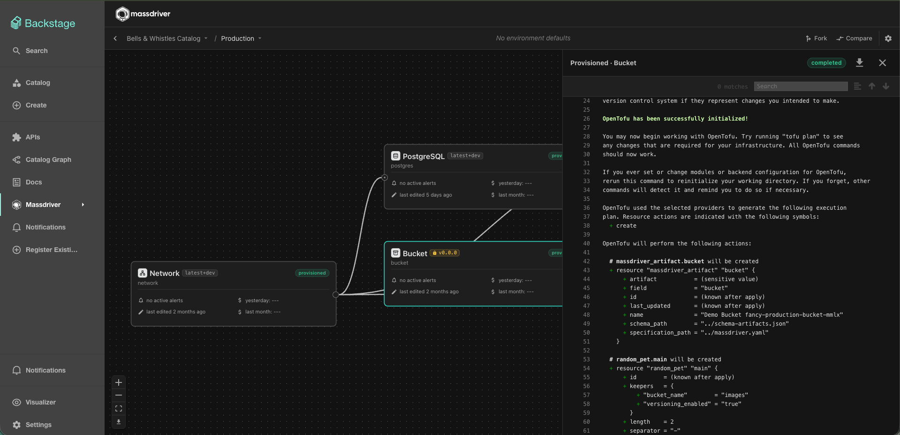

# Massdriver Backstage Plugin

[](https://www.npmjs.com/package/@massdriver/backstage-plugin)
[](LICENSE)

See your [Massdriver](https://www.massdriver.cloud/) infrastructure inside
Backstage: projects, environment graphs, instance details, repositories, and
resources — all read-only and updating live. Anything that changes
infrastructure deep-links into the Massdriver app, so Backstage stays a safe
window onto production.



## What you get

- **Projects** — an organization-wide projects list with per-project details,
  components, and environments.
- **Environment graph** — the full package graph with connections and live
  statuses, plus an instance drawer with overview, configuration, deployment
  history, logs, resources, and dependencies. Compare environments or
  deployments side by side.
- **Repositories & resources** — bundle repositories with versions and files,
  and cloud resources with usage and details.
- **Catalog integration** — annotate any catalog entity with a
  `massdriver.cloud/*` ID to get a Massdriver status card and tab on that
  entity, with "Open in Massdriver" deep-links.
- **Live updates** — views refresh in realtime via a backend relay; no
  polling, no page reloads.

|                    Projects                     |                   Instance drawer                   |                   Deployment logs                   |
| :---------------------------------------------: | :-------------------------------------------------: | :-------------------------------------------------: |
|  |  |  |

Every view is read-only. Deploys, decommissions, and configuration edits
deep-link into the Massdriver app — the plugin never mutates your
infrastructure, and its backend relay exposes no mutation endpoints.

## Requirements

- A Backstage app on the **new frontend system** (`createApp` from
  `@backstage/frontend-defaults`). The legacy frontend system is not
  supported.
- Backend outbound HTTPS **and WebSocket** access to your Massdriver API
  origin (`https://api.massdriver.cloud` unless self-hosted).
- A Massdriver **service account** token.

## Installation

From your Backstage repo root:

```bash
# Frontend
yarn --cwd packages/app add @massdriver/backstage-plugin

# Backend relay
yarn --cwd packages/backend add @massdriver/backstage-plugin-backend
```

Register the backend plugin in `packages/backend/src/index.ts`:

```ts
backend.add(import('@massdriver/backstage-plugin-backend'));
```

The frontend registers itself automatically if your app uses package
discovery (`app: { packages: all }`); otherwise add it as an explicit
feature. Then configure your credentials:

```yaml
# app-config.yaml
massdriver:
  organizationId: ${MASSDRIVER_ORG_ID}
  apiToken: ${MASSDRIVER_API_TOKEN} # secret — never sent to the browser
```

That's it — the Massdriver pages live at `/massdriver/projects`.

**Full documentation** — configuration reference, where to find your org ID
and service-account token, catalog annotations, sidebar customization, and
troubleshooting — is in the
[plugin README](plugins/massdriver/README.md).

## Packages

| npm package                                                                                                  | Role                                                       |
| ------------------------------------------------------------------------------------------------------------ | ---------------------------------------------------------- |
| [`@massdriver/backstage-plugin`](https://www.npmjs.com/package/@massdriver/backstage-plugin)                 | Frontend: pages, entity card, entity tab                   |
| [`@massdriver/backstage-plugin-backend`](https://www.npmjs.com/package/@massdriver/backstage-plugin-backend) | Backend: authenticated GraphQL relay + realtime SSE bridge |
| [`@massdriver/backstage-plugin-common`](https://www.npmjs.com/package/@massdriver/backstage-plugin-common)   | Shared config readers, annotations, deep-link builders     |

## Security model

The browser never holds a Massdriver token. All API access flows through the
backend relay, which injects the service-account token and organization ID
server-side; client-supplied organization IDs are ignored. Any authenticated
Backstage user sees whatever the service account can read — this is an
org-wide, read-only integration. Details in the
[plugin README](plugins/massdriver/README.md#security--authorization).

## Contributing

Bug reports and pull requests are welcome. See
[CONTRIBUTING.md](CONTRIBUTING.md) for local development setup, everyday
commands, and the conventions this repo follows.

## License

[Apache-2.0](LICENSE)
